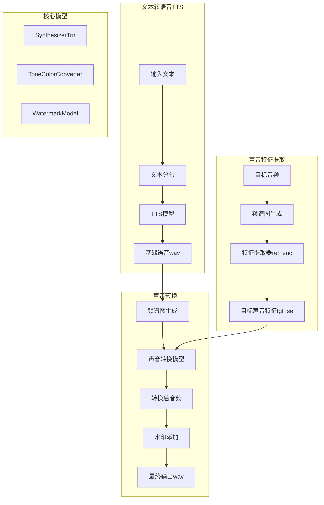

[TOC]

# openvoice 算法逻辑

## 核心组件
1. `ToneColorConverter`: 语音转换系统
    负责声音风格转换的核心模型，位于 `OpenVoiceV2/converter` 目录

2. `SE Extractor`: 声音特征提取器
    用于提取说话人的声音特征, 通过 `se_extractor.get_se()` 方法实现, 支持 `VAD (Voice Activity Detection) `功能

3. 文本转语音系统 (TTS)
    基于 `melo.api` 的多语言 `TTS` 模型.

4. 基础说话人模型
    `OpenVoiceV2/base_speakers/ses/` 目录. 每个语言都有对应的基础说话人声音特征模型（.pth 文件）

# TTS 模型详解

## 支持的语言
- 英语 (EN, EN_NEWEST)
- 中文 (ZH)
- 西班牙语 (ES)
- 法语 (FR)
- 日语 (JP)
- 韩语 (KR)

## 工作流程
1. **初始化**
   - 根据指定语言加载对应的 TTS 模型
   - 配置设备（GPU/CPU）
   - 加载语言对应的说话人 ID 映射表

2. **文本预处理**
   - 文本规范化
   - 文本分词
   - 转换为模型可处理的输入格式

3. **语音生成**
   - 文本转换为声学特征（如梅尔频谱图）
   - 通过声码器将声学特征转换为波形
   - 支持调整语速（speed 参数）

4. **输出处理**
   - 生成临时 WAV 文件
   - 可以进一步与 ToneColorConverter 结合实现声音克隆

## 使用特点
- 支持实时生成
- 可调节语速
- 每种语言有多个基础说话人可选
- 支持跨语言声音克隆
- `SE Extractor` 提取目标说话人的声音特征
- `ToneColorConverter` 将基础语音转换为目标说话人的声音风格

