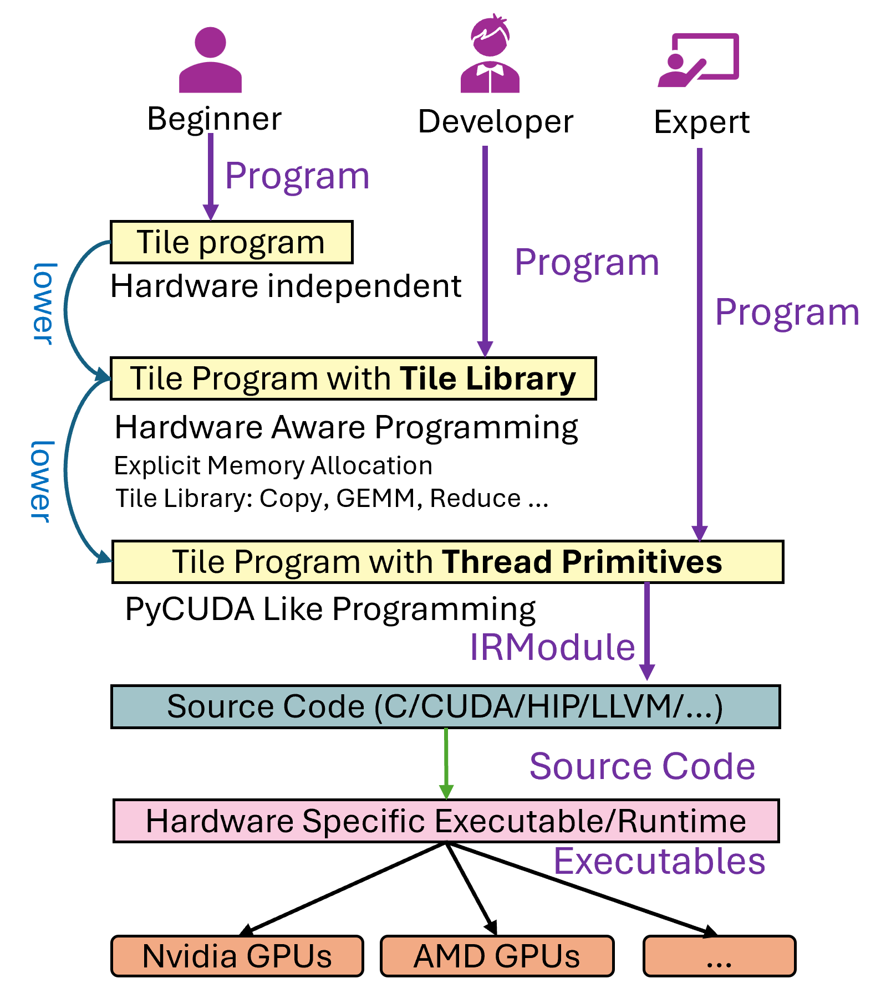

# 4090 的cuda特性

## 基本api

### 内存管理
cudaMalloc：在设备（GPU）上分配内存。
cudaFree：释放设备上的内存。
cudaMemcpy：在主机（CPU）和设备之间复制内存。

### 同步
cudaDeviceSynchronize：等待设备上的所有先前发布的任务完成。
__syncthreads()：在一个线程块内同步所有线程。

### 设备管理
cudaSetDevice：设置当前使用的GPU设备。
cudaGetDeviceProperties：获取设备的属性。

### 错误处理
cudaGetLastError：返回上一个CUDA调用的错误状态。
cudaGetErrorString：返回错误代码对应的字符串描述。


### 流（Stream）管理
cudaStreamCreate：创建一个新的流。
cudaStreamDestroy：销毁一个流。
cudaStreamSynchronize：等待一个流中的所有操作完成。

### 事件（Event）管理
cudaEventCreate：创建一个新的事件。
cudaEventRecord：在一个流中记录一个事件。
cudaEventSynchronize：等待一个事件完成。

### 原子操作
atomicAdd：原子地增加一个值。
atomicCAS：原子地比较并交换一个值。


## 从指令角度理解

ptx 独立于特定gpu架构

1. nvcc 编译 .cu 文件 ===> .ptx 代码
2. .ptx -> gpu架构的二进制代码 驱动程序在运行时完成，或者编译时通过指定目标架构 `-arch=sm_75`完成

## ptx指令
PTX指令集包括算术指令、内存访问指令、控制流指令等。例如：
add.f32：浮点数加法。
ld.global：从全局内存加载数据。
st.shared：存储数据到共享内存。
bar.sync：线程块内的同步屏障。

优化和调度：

在PTX到二进制代码的转换过程中，编译器会进行各种优化，如指令调度、寄存器分配等，以提高代码的执行效率。
这些优化旨在最大化GPU的并行计算能力，减少内存访问延迟和线程等待时间。

运行时加载：

在程序运行时，CUDA驱动程序会加载二进制代码到GPU，并管理线程的调度和执行。
PTX代码也可以在运行时由驱动程序进行即时编译（JIT），以适应不同的GPU架构。


具体指令：
算术指令：

add：整数加法。
sub：整数减法。
mul：整数乘法。
mad：乘加（multiply-add）。
fadd：浮点数加法。
fmul：浮点数乘法。
内存访问指令：

ld：从内存加载数据。
st：将数据存储到内存。
ld.global：从全局内存加载数据。
st.shared：将数据存储到共享内存。
控制流指令：

bra：无条件跳转。
setp：设置谓词寄存器。
@p：基于谓词的条件执行。
同步指令：

bar.sync：线程块内的同步屏障。
membar：内存屏障，确保内存操作的顺序。
原子操作指令：

atom.add：原子加法。
atom.cas：原子比较并交换。
转换指令：

cvt：类型转换（如整数到浮点数）。
float2int：浮点数到整数的转换。
特殊指令：

tex：纹理内存访问。
s2r：特殊寄存器访问。
逻辑指令：

and：按位与。
or：按位或。
not：按位非。

## 继续学习

一些函数

```c++
#include <ATen/Tensor.h>
#include <ATen/Functions.h>
#include <torch/csrc/utils/pybind.h>

void square_cuda_forward(void* input, void* output, int size);

at::Tensor square_forward(const at::Tensor& input) {
    auto output = at::zeros_like(input);

    square_cuda_forward(input.data_ptr(), output.data_ptr(), input.numel());

    return output;
}

PYBIND11_MODULE(TORCH_EXTENSION_NAME, m) {
    m.def("square_forward", &square_forward, "Square forward (CUDA)");
}
```


```python
os.environ["TORCH_CUDA_ARCH_LIST"] = "8.9"
start = time.time()

square_cuda = load(
    name="square_cuda",
    sources=[f"{dir_path}/square_kernel.cu"],
    verbose=True,
    build_directory=build_dir
)

end = time.time()
print(f"Time taken: {end - start} seconds")
```

# tilelang 学习

from : https://leiblog.wang/Debug-Tools-for-TileLang/

- ctypes 调用的理论开销应该在 500ns ~ 5µs 之间，基本可忽略。




# best practice

https://docs.nvidia.com/cuda/cuda-c-best-practices-guide/