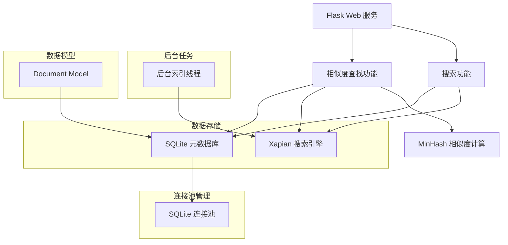
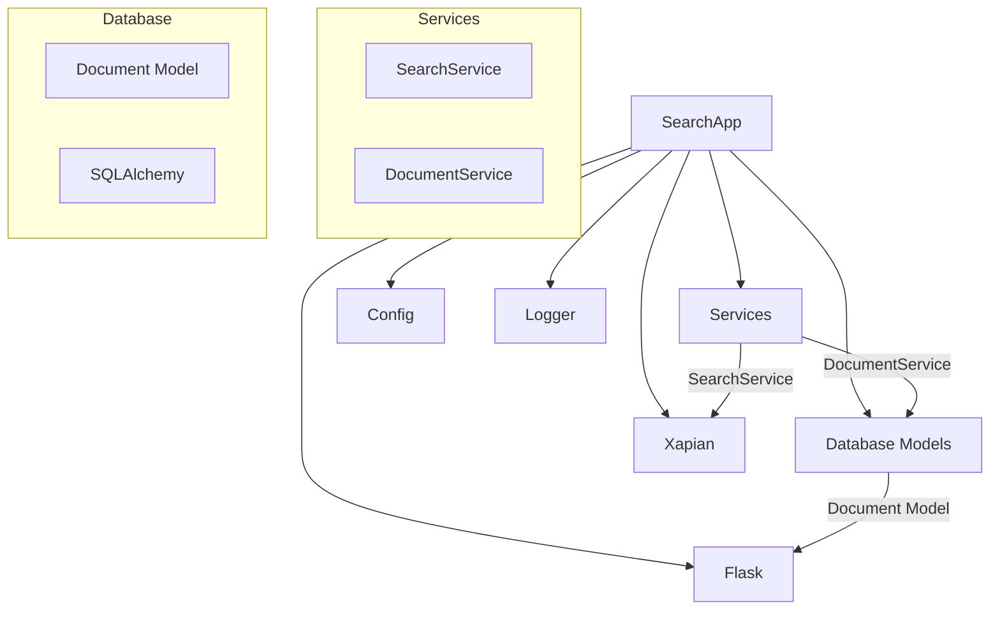
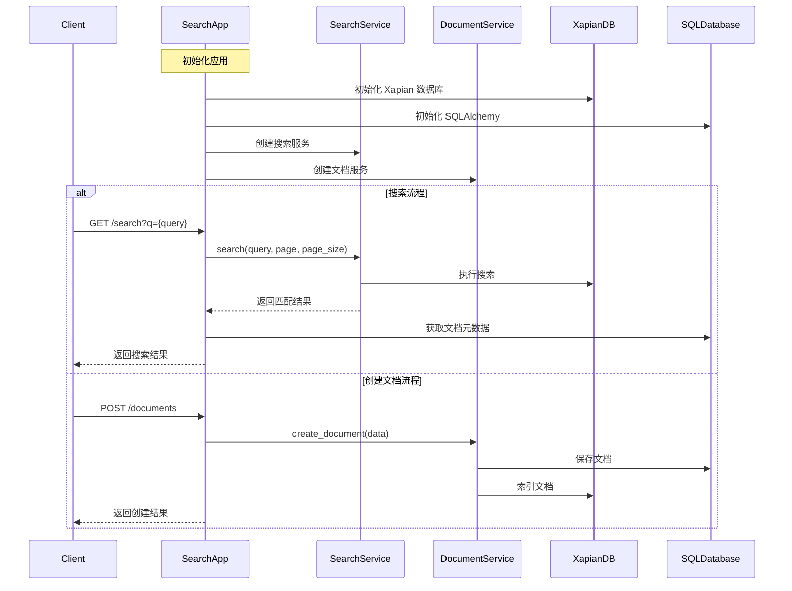
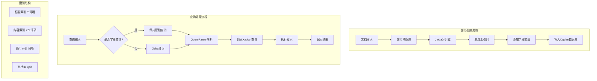

[TOC]

# Xapian-delve 使用指南及索引文件解析

## xapian-delve 工具使用

`xapian-delve` 是 Xapian 自带的一个用于检查索引文件的命令行工具，可以用来查看数据库的结构和内容。

### 基本用法

```bash
xapian-delve [选项] <数据库路径>
```

### 常用选项

- `-1`：只显示一级信息（简要概述）
- `-a`：显示所有信息（详细输出）
- `-r`：递归显示术语列表
- `-t`：显示术语列表
- `-d`：显示文档数据
- `-v`：显示版本信息

### 使用示例

1. 查看数据库基本信息：
   ```bash
   xapian-delve -1 /path/to/database
   ```

2. 查看详细数据库信息：
   ```bash
   xapian-delve -a /path/to/database
   ```

3. 查看特定文档内容（如文档ID为123）：
   ```bash
   xapian-delve -d 123 /path/to/database
   ```

## Xapian 索引文件解析

### 索引文件组成

Xapian 数据库通常由多个文件组成，存储在同一个目录中，主要文件包括：

1. **`iamtermlist.DB`**：术语列表索引
2. **`positionlist.DB`**：位置信息存储
3. **`postlist.DB`**：倒排列表存储
4. **`record.DB`**：原始文档数据存储
5. **`docdata.DB`**：文档元数据存储
6. **`spelling.DB`**：拼写校正数据
7. **`synonym.DB`**：同义词数据
8. **`flintlock`**：锁文件（临时）

### 索引文件的意义

1. **倒排索引结构**：
   - `postlist.DB` 存储术语到文档的映射（倒排列表）
   - `termlist.DB` 存储文档到术语的映射（正排列表）

2. **位置信息**：
   - `positionlist.DB` 记录术语在文档中出现的位置，用于短语查询和邻近查询

3. **文档数据**：
   - `record.DB` 存储原始文档内容
   - `docdata.DB` 存储文档的元数据

4. **辅助功能**：
   - `spelling.DB` 支持拼写校正
   - `synonym.DB` 支持同义词扩展

### 索引文件查看方法

1. **使用 xapian-delve**（如上所述）
   
2. **使用编程接口查看**（Python示例）：
   ```python
   import xapian
   
   # 打开数据库
   db = xapian.Database("/path/to/database")
   
   # 获取文档数量
   print(db.get_doccount())
   
   # 遍历所有文档
   for docid in range(1, db.get_lastdocid() + 1):
       try:
           doc = db.get_document(docid)
           print(f"Document {docid}:")
           print(doc.get_data())
       except:
           pass
   ```

3. **使用其他工具**：
   - `xapian-metadata`：查看数据库元数据
   - `xapian-pos`：查看位置信息
   - `xapian-replicate`：复制数据库工具

## 注意事项

1. **不要手动修改索引文件**：这可能导致数据库损坏
2. **锁文件**：当 Xapian 正在写入时会有 `flintlock` 文件，不要手动删除
3. **版本兼容性**：不同版本的 Xapian 可能使用不同的文件格式
4. **备份**：操作前建议备份数据库文件

通过以上工具和方法，您可以深入了解 Xapian 索引的内部结构和内容，这对于调试和优化搜索应用非常有帮助。


# xapian 搜索引擎的核心原理

1. **基本原理**  
   - Xapian 是一个概率型信息检索（Probabilistic Information Retrieval）系统  
   - 使用 BM25（Best Match 25）作为默认的排序算法
   - 支持布尔检索、短语检索和近似检索等多种检索方式

2. **核心数据结构**
   - 倒排索引（Inverted Index）：
     - 词项（Term）到文档ID的映射
     - 使用B+树存储词项字典
     - 支持前缀压缩以节省空间

   - 文档数据：
     - 文档ID到实际内容的映射
     - 支持存储原始文档或文档元数据
     - 使用 value slots 存储额外的字段数据

1. **存储方式**
- 采用 Glass 后端存储引擎
- 主要文件类型：
  - `.glass` - 主索引文件
  - `.baseA` - 文档数据
  - `.position` - 位置信息
  - `.spelling` - 拼写建议数据
- 使用事务机制确保数据一致性
- 支持增量更新，无需重建整个索引

1. **并发处理**
- 读写锁分离：
  - 多个读取操作可以并发执行
  - 写入操作需要独占锁
- 数据库级别的锁定机制：
  - `Database` 类用于只读操作
  - `WritableDatabase` 类用于写入操作

```python
# 读取操作使用 Database
xapian_db = Database(XAPIAN_DB_PATH)

# 写入操作需要使用 WritableDatabase
writable_db = WritableDatabase(XAPIAN_DB_PATH, DB_CREATE_OR_OPEN)
```

5. **性能特点**
- 索引性能：
  - 单线程写入速度可达数千文档/秒
  - 支持批量导入优化
- 查询性能：
  - 使用跳表（Skip Lists）优化倒排列表遍历
  - 查询速度与索引大小呈对数关系
- 内存使用：
  - 采用内存映射（mmap）技术
  - 支持缓存控制和优化

6. **扩展性**
- 支持自定义权重模型
- 可扩展的分词器架构
- 支持同义词、停用词等高级特性
- 支持分布式检索（需要额外配置）

在您的项目中，建议考虑以下优化：
1. 使用连接池管理 WritableDatabase 实例
2. 批量索引时使用事务提高性能
3. 考虑添加缓存层优化热点查询
4. 根据实际需求调整 BM25 参数

## 流程图

<!-- <span> -->

<!-- </span> -->







