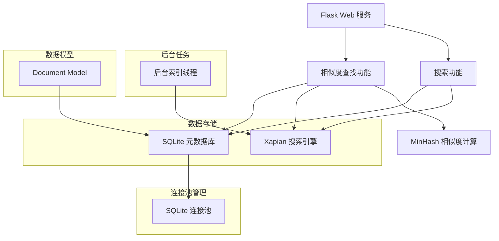
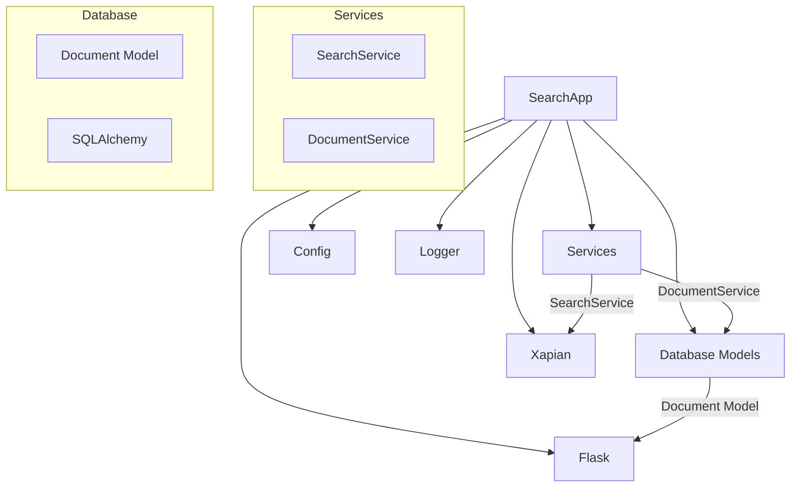
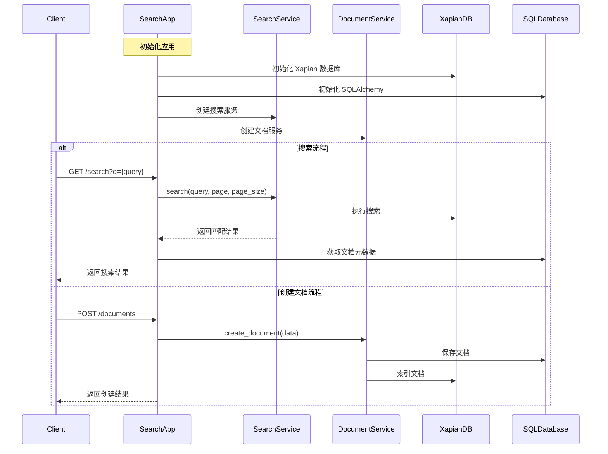

[TOC]

# xapian 搜索引擎的核心原理

1. **基本原理**  
   - Xapian 是一个概率型信息检索（Probabilistic Information Retrieval）系统  
   - 使用 BM25（Best Match 25）作为默认的排序算法
   - 支持布尔检索、短语检索和近似检索等多种检索方式

2. **核心数据结构**
   - 倒排索引（Inverted Index）：
     - 词项（Term）到文档ID的映射
     - 使用B+树存储词项字典
     - 支持前缀压缩以节省空间

   - 文档数据：
     - 文档ID到实际内容的映射
     - 支持存储原始文档或文档元数据
     - 使用 value slots 存储额外的字段数据

1. **存储方式**
- 采用 Glass 后端存储引擎
- 主要文件类型：
  - `.glass` - 主索引文件
  - `.baseA` - 文档数据
  - `.position` - 位置信息
  - `.spelling` - 拼写建议数据
- 使用事务机制确保数据一致性
- 支持增量更新，无需重建整个索引

1. **并发处理**
- 读写锁分离：
  - 多个读取操作可以并发执行
  - 写入操作需要独占锁
- 数据库级别的锁定机制：
  - `Database` 类用于只读操作
  - `WritableDatabase` 类用于写入操作

```python
# 读取操作使用 Database
xapian_db = Database(XAPIAN_DB_PATH)

# 写入操作需要使用 WritableDatabase
writable_db = WritableDatabase(XAPIAN_DB_PATH, DB_CREATE_OR_OPEN)
```

5. **性能特点**
- 索引性能：
  - 单线程写入速度可达数千文档/秒
  - 支持批量导入优化
- 查询性能：
  - 使用跳表（Skip Lists）优化倒排列表遍历
  - 查询速度与索引大小呈对数关系
- 内存使用：
  - 采用内存映射（mmap）技术
  - 支持缓存控制和优化

6. **扩展性**
- 支持自定义权重模型
- 可扩展的分词器架构
- 支持同义词、停用词等高级特性
- 支持分布式检索（需要额外配置）

在您的项目中，建议考虑以下优化：
1. 使用连接池管理 WritableDatabase 实例
2. 批量索引时使用事务提高性能
3. 考虑添加缓存层优化热点查询
4. 根据实际需求调整 BM25 参数

## 流程图

<!-- <span> -->

<!-- </span> -->





