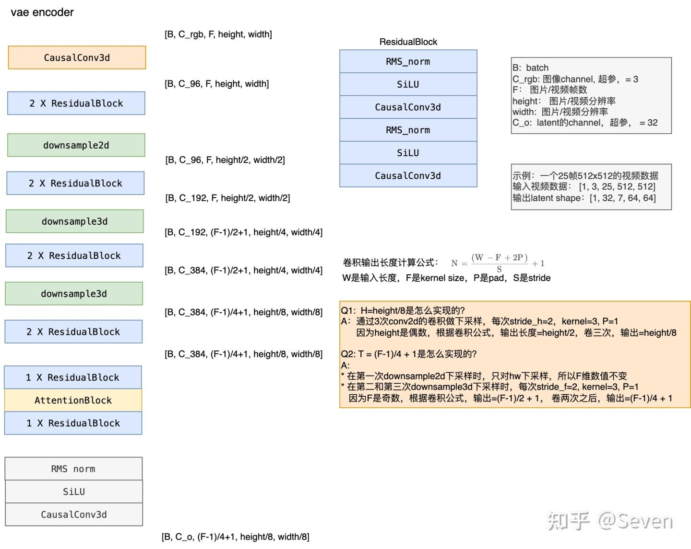
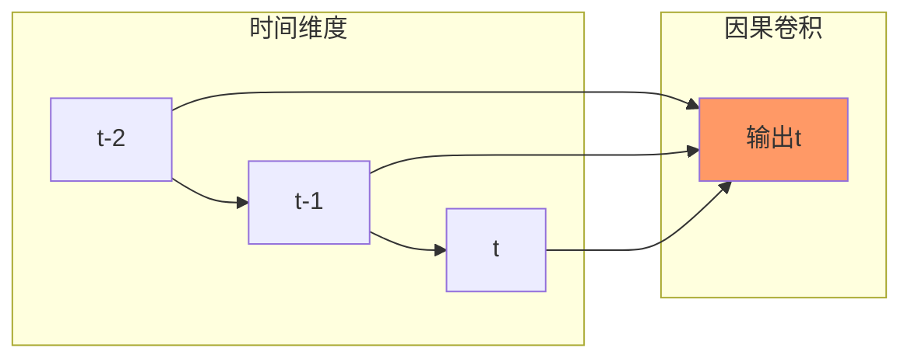
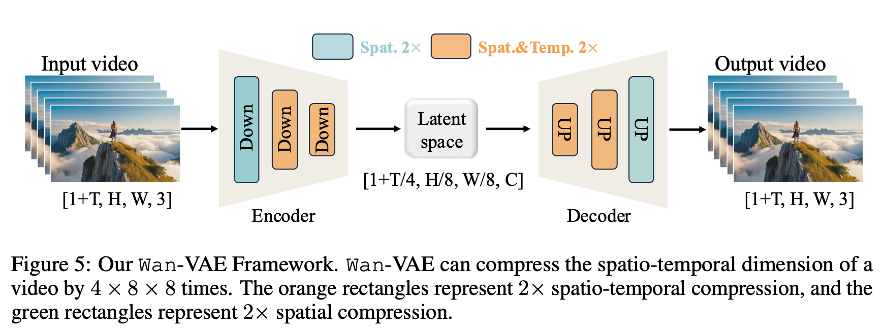
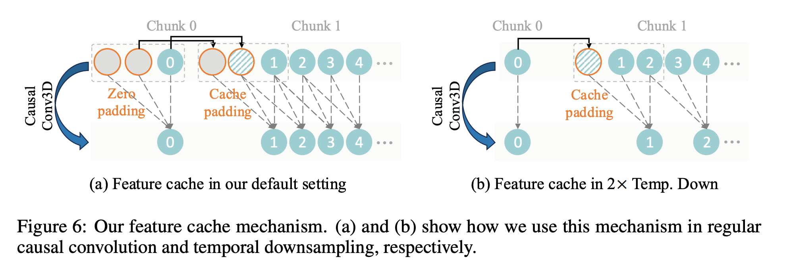
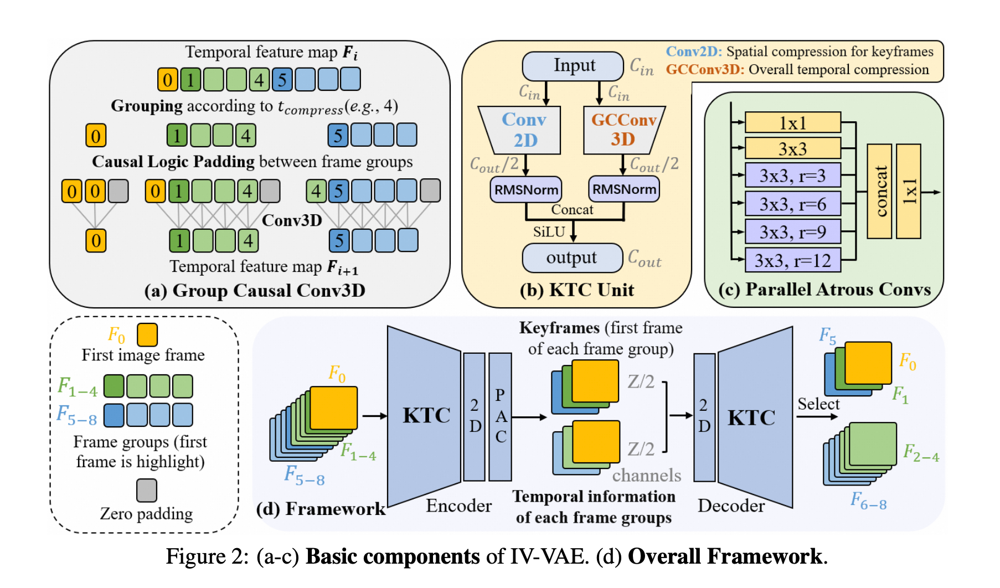

## vae-3d conv

Wan-VAE 分块因果3D卷积

from https://zhuanlan.zhihu.com/p/29268015945

```python
class CausalConv3d(nn.Conv3d):
    """
    Causal 3d convolusion.
    """

    def __init__(self, *args, **kwargs):
        super().__init__(*args, **kwargs)
        self._padding = (self.padding[2], self.padding[2], self.padding[1],
                         self.padding[1], 2 * self.padding[0], 0)
        self.padding = (0, 0, 0)

    def forward(self, x, cache_x=None):
        padding = list(self._padding)
        if cache_x is not None and self._padding[4] > 0:
            cache_x = cache_x.to(x.device)
            x = torch.cat([cache_x, x], dim=2)
            padding[4] -= cache_x.shape[2]
        x = F.pad(x, padding)

        return super().forward(x)
```

```log
(Pdb) p self.decoder
WanDecoder3d(
  (nonlinearity): SiLU()
  (conv_in): WanCausalConv3d(16, 384, kernel_size=(3, 3, 3), stride=(1, 1, 1))
  (mid_block): WanMidBlock(
    (attentions): ModuleList(
      (0): WanAttentionBlock(
        (norm): WanRMS_norm()
        (to_qkv): Conv2d(384, 1152, kernel_size=(1, 1), stride=(1, 1))
        (proj): Conv2d(384, 384, kernel_size=(1, 1), stride=(1, 1))
      )
    )
    (resnets): ModuleList(
      (0-1): 2 x WanResidualBlock(
        (nonlinearity): SiLU()
        (norm1): WanRMS_norm()
        (conv1): WanCausalConv3d(384, 384, kernel_size=(3, 3, 3), stride=(1, 1, 1))
        (norm2): WanRMS_norm()
        (dropout): Dropout(p=0.0, inplace=False)
        (conv2): WanCausalConv3d(384, 384, kernel_size=(3, 3, 3), stride=(1, 1, 1))
        (conv_shortcut): Identity()
      )
    )
  )
  (up_blocks): ModuleList(
    (0): WanUpBlock(
      (resnets): ModuleList(
        (0-1): 2 x WanResidualBlock(
          (nonlinearity): SiLU()
          (norm1): WanRMS_norm()
          (conv1): WanCausalConv3d(384, 384, kernel_size=(3, 3, 3), stride=(1, 1, 1))
          (norm2): WanRMS_norm()
          (dropout): Dropout(p=0.0, inplace=False)
          (conv2): WanCausalConv3d(384, 384, kernel_size=(3, 3, 3), stride=(1, 1, 1))
          (conv_shortcut): Identity()
        )
      )
      (upsamplers): ModuleList(
        (0): WanResample(
          (resample): Sequential(
            (0): WanUpsample(scale_factor=(2.0, 2.0), mode='nearest-exact')
            (1): Conv2d(384, 192, kernel_size=(3, 3), stride=(1, 1), padding=(1, 1))
          )
          (time_conv): WanCausalConv3d(384, 768, kernel_size=(3, 1, 1), stride=(1, 1, 1))
        )
      )
    )
    (1): WanUpBlock(
      (resnets): ModuleList(
        (0): WanResidualBlock(
          (nonlinearity): SiLU()
          (norm1): WanRMS_norm()
          (conv1): WanCausalConv3d(192, 384, kernel_size=(3, 3, 3), stride=(1, 1, 1))
          (norm2): WanRMS_norm()
          (dropout): Dropout(p=0.0, inplace=False)
          (conv2): WanCausalConv3d(384, 384, kernel_size=(3, 3, 3), stride=(1, 1, 1))
          (conv_shortcut): WanCausalConv3d(192, 384, kernel_size=(1, 1, 1), stride=(1, 1, 1))
        )
        (1): WanResidualBlock(
          (nonlinearity): SiLU()
          (norm1): WanRMS_norm()
          (conv1): WanCausalConv3d(384, 384, kernel_size=(3, 3, 3), stride=(1, 1, 1))
          (norm2): WanRMS_norm()
          (dropout): Dropout(p=0.0, inplace=False)
          (conv2): WanCausalConv3d(384, 384, kernel_size=(3, 3, 3), stride=(1, 1, 1))
          (conv_shortcut): Identity()
        )
      )
      (upsamplers): ModuleList(
        (0): WanResample(
          (resample): Sequential(
            (0): WanUpsample(scale_factor=(2.0, 2.0), mode='nearest-exact')
            (1): Conv2d(384, 192, kernel_size=(3, 3), stride=(1, 1), padding=(1, 1))
          )
          (time_conv): WanCausalConv3d(384, 768, kernel_size=(3, 1, 1), stride=(1, 1, 1))
        )
      )
    )
    (2): WanUpBlock(
      (resnets): ModuleList(
        (0-1): 2 x WanResidualBlock(
          (nonlinearity): SiLU()
          (norm1): WanRMS_norm()
          (conv1): WanCausalConv3d(192, 192, kernel_size=(3, 3, 3), stride=(1, 1, 1))
          (norm2): WanRMS_norm()
          (dropout): Dropout(p=0.0, inplace=False)
          (conv2): WanCausalConv3d(192, 192, kernel_size=(3, 3, 3), stride=(1, 1, 1))
          (conv_shortcut): Identity()
        )
      )
      (upsamplers): ModuleList(
        (0): WanResample(
          (resample): Sequential(
            (0): WanUpsample(scale_factor=(2.0, 2.0), mode='nearest-exact')
            (1): Conv2d(192, 96, kernel_size=(3, 3), stride=(1, 1), padding=(1, 1))
          )
        )
      )
    )
    (3): WanUpBlock(
      (resnets): ModuleList(
        (0-1): 2 x WanResidualBlock(
          (nonlinearity): SiLU()
          (norm1): WanRMS_norm()
          (conv1): WanCausalConv3d(96, 96, kernel_size=(3, 3, 3), stride=(1, 1, 1))
          (norm2): WanRMS_norm()
          (dropout): Dropout(p=0.0, inplace=False)
          (conv2): WanCausalConv3d(96, 96, kernel_size=(3, 3, 3), stride=(1, 1, 1))
          (conv_shortcut): Identity()
        )
      )
    )
  )
  (norm_out): WanRMS_norm()
  (conv_out): WanCausalConv3d(96, 3, kernel_size=(3, 3, 3), stride=(1, 1, 1))
)
```

3D因果VAE架构

1. cache卷积输入，流式推理，每次推理一段，显存占用显著减少
2. `Wan-VAE`可以编码和解码不限制长度的1080P视频，而不会丢失历史时间信息，使其特别适合视频生成任务




```python
class WanCausalConv3d(nn.Conv3d):
    r"""
    A custom 3D causal convolution layer with feature caching support.

    This layer extends the standard Conv3D layer by ensuring causality in the time dimension and handling feature
    caching for efficient inference.

    Args:
        in_channels (int): Number of channels in the input image
        out_channels (int): Number of channels produced by the convolution
        kernel_size (int or tuple): Size of the convolving kernel
        stride (int or tuple, optional): Stride of the convolution. Default: 1
        padding (int or tuple, optional): Zero-padding added to all three sides of the input. Default: 0
    """

    def __init__(
        self,
        in_channels: int,
        out_channels: int,
        kernel_size: Union[int, Tuple[int, int, int]],
        stride: Union[int, Tuple[int, int, int]] = 1,
        padding: Union[int, Tuple[int, int, int]] = 0,
    ) -> None:
        super().__init__(
            in_channels=in_channels,
            out_channels=out_channels,
            kernel_size=kernel_size,
            stride=stride,
            padding=padding,
        )

        # Set up causal padding
        self._padding = (self.padding[2], self.padding[2], self.padding[1], self.padding[1], 2 * self.padding[0], 0)
        self.padding = (0, 0, 0)

    def forward(self, x, cache_x=None):
        padding = list(self._padding)
        if cache_x is not None and self._padding[4] > 0:
            cache_x = cache_x.to(x.device)
            x = torch.cat([cache_x, x], dim=2)
            padding[4] -= cache_x.shape[2]
        x = F.pad(x, padding)
        return super().forward(x)
```


```python
class WanMidBlock(nn.Module):

    def __init__(self, dim: int, dropout: float = 0.0, non_linearity: str = "silu", num_layers: int = 1):
        super().__init__()
        self.dim = dim

        # Create the components
        resnets = [WanResidualBlock(dim, dim, dropout, non_linearity)]
        attentions = []
        for _ in range(num_layers):
            attentions.append(WanAttentionBlock(dim))
            resnets.append(WanResidualBlock(dim, dim, dropout, non_linearity))
        self.attentions = nn.ModuleList(attentions)
        self.resnets = nn.ModuleList(resnets)

        self.gradient_checkpointing = False

    def forward(self, x, feat_cache=None, feat_idx=[0]):
        # First residual block
        x = self.resnets[0](x, feat_cache, feat_idx)

        # Process through attention and residual blocks
        for attn, resnet in zip(self.attentions, self.resnets[1:]):
            if attn is not None:
                x = attn(x)

            x = resnet(x, feat_cache, feat_idx)

        return x
```


```python
class WanResidualBlock(nn.Module):
    r"""
    A custom residual block module.

    Args:
        in_dim (int): Number of input channels.
        out_dim (int): Number of output channels.
        dropout (float, optional): Dropout rate for the dropout layer. Default is 0.0.
        non_linearity (str, optional): Type of non-linearity to use. Default is "silu".
    """

    def __init__(
        self,
        in_dim: int,
        out_dim: int,
        dropout: float = 0.0,
        non_linearity: str = "silu",
    ) -> None:
        super().__init__()
        self.in_dim = in_dim
        self.out_dim = out_dim
        self.nonlinearity = get_activation(non_linearity)

        # layers
        self.norm1 = WanRMS_norm(in_dim, images=False)
        self.conv1 = WanCausalConv3d(in_dim, out_dim, 3, padding=1)
        self.norm2 = WanRMS_norm(out_dim, images=False)
        self.dropout = nn.Dropout(dropout)
        self.conv2 = WanCausalConv3d(out_dim, out_dim, 3, padding=1)
        self.conv_shortcut = WanCausalConv3d(in_dim, out_dim, 1) if in_dim != out_dim else nn.Identity()

    def forward(self, x, feat_cache=None, feat_idx=[0]):
        # Apply shortcut connection
        h = self.conv_shortcut(x)

        # First normalization and activation
        x = self.norm1(x)
        x = self.nonlinearity(x)

        if feat_cache is not None:
            idx = feat_idx[0]
            cache_x = x[:, :, -CACHE_T:, :, :].clone()
            if cache_x.shape[2] < 2 and feat_cache[idx] is not None:
                cache_x = torch.cat([feat_cache[idx][:, :, -1, :, :].unsqueeze(2).to(cache_x.device), cache_x], dim=2)

            x = self.conv1(x, feat_cache[idx])
            feat_cache[idx] = cache_x
            feat_idx[0] += 1
        else:
            x = self.conv1(x)

        # Second normalization and activation
        x = self.norm2(x)
        x = self.nonlinearity(x)

        # Dropout
        x = self.dropout(x)

        if feat_cache is not None:
            idx = feat_idx[0]
            cache_x = x[:, :, -CACHE_T:, :, :].clone()
            if cache_x.shape[2] < 2 and feat_cache[idx] is not None:
                cache_x = torch.cat([feat_cache[idx][:, :, -1, :, :].unsqueeze(2).to(cache_x.device), cache_x], dim=2)

            x = self.conv2(x, feat_cache[idx])
            feat_cache[idx] = cache_x
            feat_idx[0] += 1
        else:
            x = self.conv2(x)

        # Add residual connection
        return x + h
```

```python
    def _decode(self, z: torch.Tensor, return_dict: bool = True) -> Union[DecoderOutput, torch.Tensor]:
        self.clear_cache()

        iter_ = z.shape[2]
        x = self.post_quant_conv(z)
        breakpoint()
        for i in range(iter_):
            self._conv_idx = [0]
            if i == 0:
                # 逐帧去做的处理
                out  = self.decoder(x[:, :, i : i + 1, :, :], feat_cache=self._feat_map, feat_idx=self._conv_idx)
            else:
                out_ = self.decoder(x[:, :, i : i + 1, :, :], feat_cache=self._feat_map, feat_idx=self._conv_idx)
                out = torch.cat([out, out_], 2)

        out = torch.clamp(out, min=-1.0, max=1.0)
        self.clear_cache()
        if not return_dict:
            return (out,)

        return DecoderOutput(sample=out)
```


```python
class WanDecoder3d(nn.Module):
    def __init__(
        self,
        dim=128,
        z_dim=4,
        dim_mult=[1, 2, 4, 4],
        num_res_blocks=2,
        attn_scales=[],
        temperal_upsample=[False, True, True],
        dropout=0.0,
        non_linearity: str = "silu",
    ):
        super().__init__()
        self.dim = dim
        self.z_dim = z_dim
        self.dim_mult = dim_mult
        self.num_res_blocks = num_res_blocks
        self.attn_scales = attn_scales
        self.temperal_upsample = temperal_upsample

        self.nonlinearity = get_activation(non_linearity)

        # dimensions
        dims = [dim * u for u in [dim_mult[-1]] + dim_mult[::-1]]
        scale = 1.0 / 2 ** (len(dim_mult) - 2)

        # init block
        self.conv_in = WanCausalConv3d(z_dim, dims[0], 3, padding=1)

        # middle blocks
        self.mid_block = WanMidBlock(dims[0], dropout, non_linearity, num_layers=1)

        # upsample blocks
        self.up_blocks = nn.ModuleList([])
        for i, (in_dim, out_dim) in enumerate(zip(dims[:-1], dims[1:])):
            # residual (+attention) blocks
            if i > 0:
                in_dim = in_dim // 2

            # Determine if we need upsampling
            upsample_mode = None
            if i != len(dim_mult) - 1:
                upsample_mode = "upsample3d" if temperal_upsample[i] else "upsample2d"

            # Create and add the upsampling block
            up_block = WanUpBlock(
                in_dim=in_dim,
                out_dim=out_dim,
                num_res_blocks=num_res_blocks,
                dropout=dropout,
                upsample_mode=upsample_mode,
                non_linearity=non_linearity,
            )
            self.up_blocks.append(up_block)

            # Update scale for next iteration
            if upsample_mode is not None:
                scale *= 2.0

        # output blocks
        self.norm_out = WanRMS_norm(out_dim, images=False)
        self.conv_out = WanCausalConv3d(out_dim, 3, 3, padding=1)

        self.gradient_checkpointing = False

    def forward(self, x, feat_cache=None, feat_idx=[0]):
        ## conv1
        if feat_cache is not None:
            idx = feat_idx[0]
            cache_x = x[:, :, -CACHE_T:, :, :].clone()
            if cache_x.shape[2] < 2 and feat_cache[idx] is not None:
                # cache last frame of last two chunk
                cache_x = torch.cat([feat_cache[idx][:, :, -1, :, :].unsqueeze(2).to(cache_x.device), cache_x], dim=2)
            x = self.conv_in(x, feat_cache[idx])
            feat_cache[idx] = cache_x
            feat_idx[0] += 1
        else:
            x = self.conv_in(x)

        ## middle
        x = self.mid_block(x, feat_cache, feat_idx)

        ## upsamples
        for up_block in self.up_blocks:
            x = up_block(x, feat_cache, feat_idx)

        ## head
        x = self.norm_out(x)
        x = self.nonlinearity(x)
        if feat_cache is not None:
            idx = feat_idx[0]
            cache_x = x[:, :, -CACHE_T:, :, :].clone()
            if cache_x.shape[2] < 2 and feat_cache[idx] is not None:
                # cache last frame of last two chunk
                cache_x = torch.cat([feat_cache[idx][:, :, -1, :, :].unsqueeze(2).to(cache_x.device), cache_x], dim=2)
            x = self.conv_out(x, feat_cache[idx])
            feat_cache[idx] = cache_x
            feat_idx[0] += 1
        else:
            x = self.conv_out(x)
        return x
```




```python
class WanUpBlock(nn.Module):
    def __init__(
        self,
        in_dim: int,
        out_dim: int,
        num_res_blocks: int,
        dropout: float = 0.0,
        upsample_mode: Optional[str] = None,
        non_linearity: str = "silu",
    ):
        super().__init__()
        self.in_dim = in_dim
        self.out_dim = out_dim

        # Create layers list
        resnets = []
        # Add residual blocks and attention if needed
        current_dim = in_dim
        for _ in range(num_res_blocks + 1):
            resnets.append(WanResidualBlock(current_dim, out_dim, dropout, non_linearity))
            current_dim = out_dim

        self.resnets = nn.ModuleList(resnets)

        # Add upsampling layer if needed
        self.upsamplers = None
        if upsample_mode is not None:
            self.upsamplers = nn.ModuleList([WanResample(out_dim, mode=upsample_mode)])

        self.gradient_checkpointing = False

    def forward(self, x, feat_cache=None, feat_idx=[0]):
        for resnet in self.resnets:
            if feat_cache is not None:
                x = resnet(x, feat_cache, feat_idx)
            else:
                x = resnet(x)

        if self.upsamplers is not None:
            if feat_cache is not None:
                x = self.upsamplers[0](x, feat_cache, feat_idx)
            else:
                x = self.upsamplers[0](x)
        return x
```

现在最大的问题就是 `feat_cache`

貌似每一轮都会有一个cache过程？而且在一个 self.decoder 就会几乎打满25个feat_cache位置。

<!--  -->
这里的动态很多.具体内容包括.

他的shape也很奇怪.


paper: https://files.alicdn.com/tpsservice/5c9de1c74de03972b7aa657e5a54756b.pdf







整体结构参考：




第二压缩帧的内容
```log
x.shape:  torch.Size([1, 16, 1, 90, 128])
before  [1, 1, 1, 1, 2, 0]
after   [1, 1, 1, 1, 1, 0]
feat_cache torch.Size([1, 16, 2, 90, 128])
before  [1, 1, 1, 1, 2, 0]
after   [1, 1, 1, 1, 1, 0]
before  [1, 1, 1, 1, 2, 0]
after   [1, 1, 1, 1, 1, 0]
before  [1, 1, 1, 1, 2, 0]
after   [1, 1, 1, 1, 1, 0]
before  [1, 1, 1, 1, 2, 0]
after   [1, 1, 1, 1, 1, 0]
before  [1, 1, 1, 1, 2, 0]
after   [1, 1, 1, 1, 1, 0]
before  [1, 1, 1, 1, 2, 0]
after   [1, 1, 1, 1, 1, 0]
before  [1, 1, 1, 1, 2, 0]
after   [1, 1, 1, 1, 1, 0]
before  [1, 1, 1, 1, 2, 0]
after   [1, 1, 1, 1, 1, 0]
before  [1, 1, 1, 1, 2, 0]
after   [1, 1, 1, 1, 1, 0]
before  [1, 1, 1, 1, 2, 0]
after   [1, 1, 1, 1, 1, 0]
before  [1, 1, 1, 1, 2, 0]
after   [1, 1, 1, 1, 1, 0]
before  [1, 1, 1, 1, 2, 0]
after   [1, 1, 1, 1, 1, 0]
before  [1, 1, 1, 1, 2, 0]
after   [1, 1, 1, 1, 1, 0]
before  [1, 1, 1, 1, 2, 0]
after   [1, 1, 1, 1, 1, 0]
before  [1, 1, 1, 1, 2, 0]
after   [1, 1, 1, 1, 1, 0]
before  [1, 1, 1, 1, 2, 0]
after   [1, 1, 1, 1, 1, 0]
before  [1, 1, 1, 1, 2, 0]
after   [1, 1, 1, 1, 1, 0]
before  [1, 1, 1, 1, 2, 0]
after   [1, 1, 1, 1, 1, 0]
before  [1, 1, 1, 1, 2, 0]
after   [1, 1, 1, 1, 1, 0]
before  [1, 1, 1, 1, 2, 0]
after   [1, 1, 1, 1, 1, 0]
before  [1, 1, 1, 1, 2, 0]
after   [1, 1, 1, 1, 1, 0]
```
第三压缩帧
```log
x.shape:  torch.Size([1, 16, 1, 90, 128])
before  [1, 1, 1, 1, 2, 0]
after   [1, 1, 1, 1, 0, 0]
feat_cache torch.Size([1, 16, 2, 90, 128])
before  [1, 1, 1, 1, 2, 0]
after   [1, 1, 1, 1, 0, 0]
before  [1, 1, 1, 1, 2, 0]
after   [1, 1, 1, 1, 0, 0]
before  [1, 1, 1, 1, 2, 0]
after   [1, 1, 1, 1, 0, 0]
before  [1, 1, 1, 1, 2, 0]
after   [1, 1, 1, 1, 0, 0]
before  [1, 1, 1, 1, 2, 0]
after   [1, 1, 1, 1, 0, 0]
before  [1, 1, 1, 1, 2, 0]
after   [1, 1, 1, 1, 0, 0]
before  [1, 1, 1, 1, 2, 0]
after   [1, 1, 1, 1, 0, 0]
before  [1, 1, 1, 1, 2, 0]
after   [1, 1, 1, 1, 0, 0]
before  [0, 0, 0, 0, 2, 0]
after   [0, 0, 0, 0, 0, 0]
before  [1, 1, 1, 1, 2, 0]
after   [1, 1, 1, 1, 0, 0]
before  [1, 1, 1, 1, 2, 0]
after   [1, 1, 1, 1, 0, 0]
before  [1, 1, 1, 1, 2, 0]
after   [1, 1, 1, 1, 0, 0]
before  [1, 1, 1, 1, 2, 0]
after   [1, 1, 1, 1, 0, 0]
before  [0, 0, 0, 0, 2, 0]
after   [0, 0, 0, 0, 0, 0]
before  [1, 1, 1, 1, 2, 0]
after   [1, 1, 1, 1, 0, 0]
before  [1, 1, 1, 1, 2, 0]
after   [1, 1, 1, 1, 0, 0]
before  [1, 1, 1, 1, 2, 0]
after   [1, 1, 1, 1, 0, 0]
before  [1, 1, 1, 1, 2, 0]
after   [1, 1, 1, 1, 0, 0]
before  [1, 1, 1, 1, 2, 0]
after   [1, 1, 1, 1, 0, 0]
before  [1, 1, 1, 1, 2, 0]
after   [1, 1, 1, 1, 0, 0]
before  [1, 1, 1, 1, 2, 0]
after   [1, 1, 1, 1, 0, 0]
before  [1, 1, 1, 1, 2, 0]
after   [1, 1, 1, 1, 0, 0]
before  [1, 1, 1, 1, 2, 0]
after   [1, 1, 1, 1, 0, 0]
```

第4帧
```log
x.shape:  torch.Size([1, 16, 1, 90, 128])
before  [1, 1, 1, 1, 2, 0]
after   [1, 1, 1, 1, 0, 0]
feat_cache torch.Size([1, 16, 2, 90, 128])
before  [1, 1, 1, 1, 2, 0]
after   [1, 1, 1, 1, 0, 0]
before  [1, 1, 1, 1, 2, 0]
after   [1, 1, 1, 1, 0, 0]
before  [1, 1, 1, 1, 2, 0]
after   [1, 1, 1, 1, 0, 0]
before  [1, 1, 1, 1, 2, 0]
after   [1, 1, 1, 1, 0, 0]
before  [1, 1, 1, 1, 2, 0]
after   [1, 1, 1, 1, 0, 0]
before  [1, 1, 1, 1, 2, 0]
after   [1, 1, 1, 1, 0, 0]
before  [1, 1, 1, 1, 2, 0]
after   [1, 1, 1, 1, 0, 0]
before  [1, 1, 1, 1, 2, 0]
after   [1, 1, 1, 1, 0, 0]
before  [0, 0, 0, 0, 2, 0]
after   [0, 0, 0, 0, 0, 0]
before  [1, 1, 1, 1, 2, 0]
after   [1, 1, 1, 1, 0, 0]
before  [1, 1, 1, 1, 2, 0]
after   [1, 1, 1, 1, 0, 0]
before  [1, 1, 1, 1, 2, 0]
after   [1, 1, 1, 1, 0, 0]
before  [1, 1, 1, 1, 2, 0]
after   [1, 1, 1, 1, 0, 0]
before  [0, 0, 0, 0, 2, 0]
after   [0, 0, 0, 0, 0, 0]
before  [1, 1, 1, 1, 2, 0]
after   [1, 1, 1, 1, 0, 0]
before  [1, 1, 1, 1, 2, 0]
after   [1, 1, 1, 1, 0, 0]
before  [1, 1, 1, 1, 2, 0]
after   [1, 1, 1, 1, 0, 0]
before  [1, 1, 1, 1, 2, 0]
after   [1, 1, 1, 1, 0, 0]
before  [1, 1, 1, 1, 2, 0]
after   [1, 1, 1, 1, 0, 0]
before  [1, 1, 1, 1, 2, 0]
after   [1, 1, 1, 1, 0, 0]
before  [1, 1, 1, 1, 2, 0]
after   [1, 1, 1, 1, 0, 0]
before  [1, 1, 1, 1, 2, 0]
after   [1, 1, 1, 1, 0, 0]
before  [1, 1, 1, 1, 2, 0]
after   [1, 1, 1, 1, 0, 0]
```

5
```log
x.shape:  torch.Size([1, 16, 1, 90, 128])
before  [1, 1, 1, 1, 2, 0]
after   [1, 1, 1, 1, 0, 0]
feat_cache torch.Size([1, 16, 2, 90, 128])
before  [1, 1, 1, 1, 2, 0]
after   [1, 1, 1, 1, 0, 0]
before  [1, 1, 1, 1, 2, 0]
after   [1, 1, 1, 1, 0, 0]
before  [1, 1, 1, 1, 2, 0]
after   [1, 1, 1, 1, 0, 0]
before  [1, 1, 1, 1, 2, 0]
after   [1, 1, 1, 1, 0, 0]
before  [1, 1, 1, 1, 2, 0]
after   [1, 1, 1, 1, 0, 0]
before  [1, 1, 1, 1, 2, 0]
after   [1, 1, 1, 1, 0, 0]
before  [1, 1, 1, 1, 2, 0]
after   [1, 1, 1, 1, 0, 0]
before  [1, 1, 1, 1, 2, 0]
after   [1, 1, 1, 1, 0, 0]
before  [0, 0, 0, 0, 2, 0]
after   [0, 0, 0, 0, 0, 0]
before  [1, 1, 1, 1, 2, 0]
after   [1, 1, 1, 1, 0, 0]
before  [1, 1, 1, 1, 2, 0]
after   [1, 1, 1, 1, 0, 0]
before  [1, 1, 1, 1, 2, 0]
after   [1, 1, 1, 1, 0, 0]
before  [1, 1, 1, 1, 2, 0]
after   [1, 1, 1, 1, 0, 0]
before  [0, 0, 0, 0, 2, 0]
after   [0, 0, 0, 0, 0, 0]
before  [1, 1, 1, 1, 2, 0]
after   [1, 1, 1, 1, 0, 0]
before  [1, 1, 1, 1, 2, 0]
after   [1, 1, 1, 1, 0, 0]
before  [1, 1, 1, 1, 2, 0]
after   [1, 1, 1, 1, 0, 0]
before  [1, 1, 1, 1, 2, 0]
after   [1, 1, 1, 1, 0, 0]
before  [1, 1, 1, 1, 2, 0]
after   [1, 1, 1, 1, 0, 0]
before  [1, 1, 1, 1, 2, 0]
after   [1, 1, 1, 1, 0, 0]
before  [1, 1, 1, 1, 2, 0]
after   [1, 1, 1, 1, 0, 0]
before  [1, 1, 1, 1, 2, 0]
after   [1, 1, 1, 1, 0, 0]
before  [1, 1, 1, 1, 2, 0]
after   [1, 1, 1, 1, 0, 0]
```

目前发现 第一帧和第二帧的行为与后面都不太一样


### 新的策略
1. 得到所有的shape 走动态

用 torchview 得到所有的结构和shape