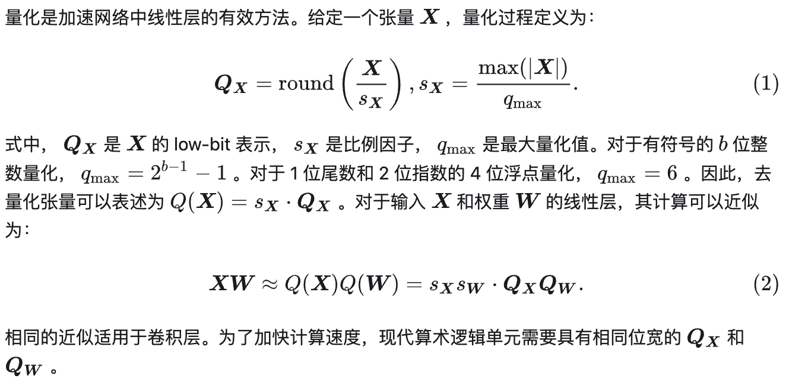
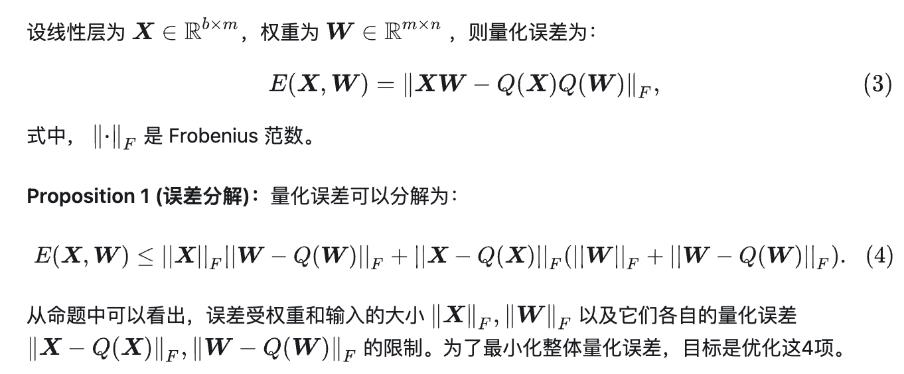
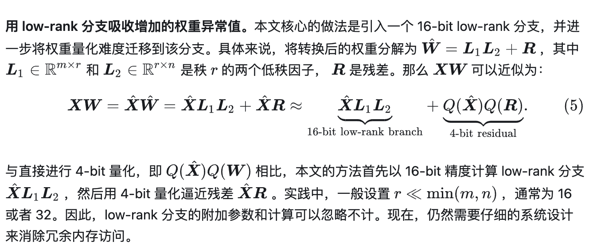
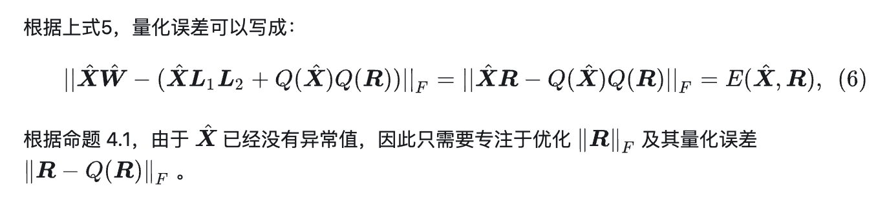
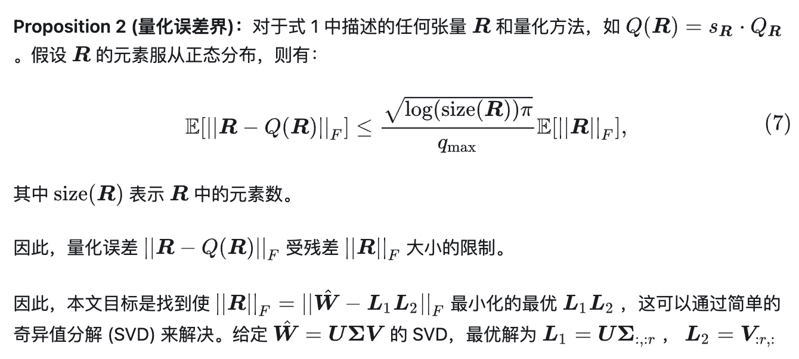
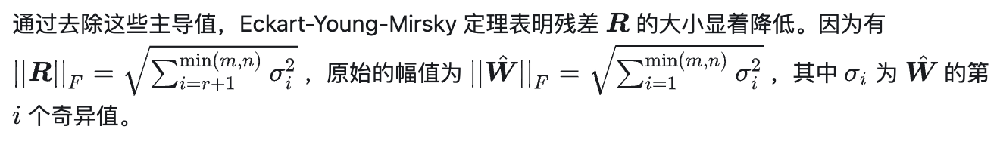
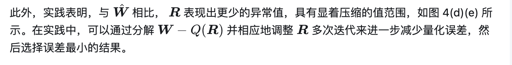
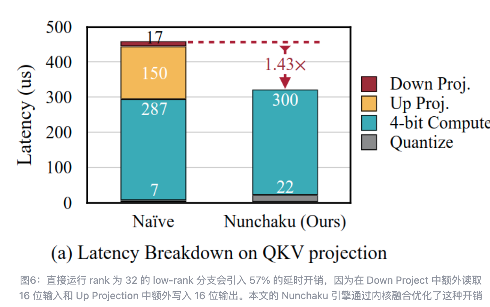
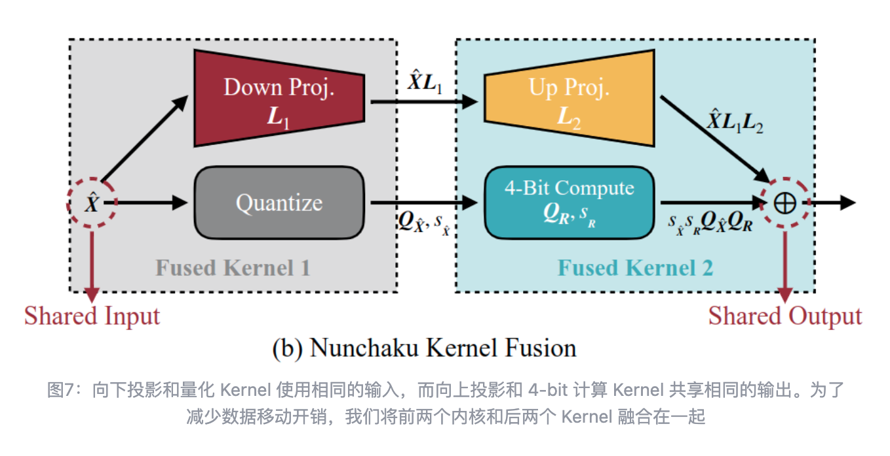

[TOC]

## svd quant 吸收异常值量化 4-bit 扩散模型

- `8-bit setting`：Weight：Per-channel，Activation：Per-token Dynamic
- `4-bit setting`：Weight：Per-group symmetric，Activation：Per-group symmetric
  
  

这张图公式应该有问题

## web3 
