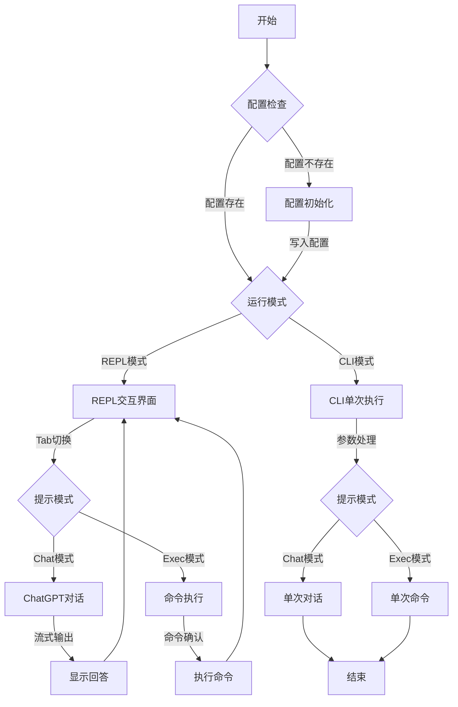
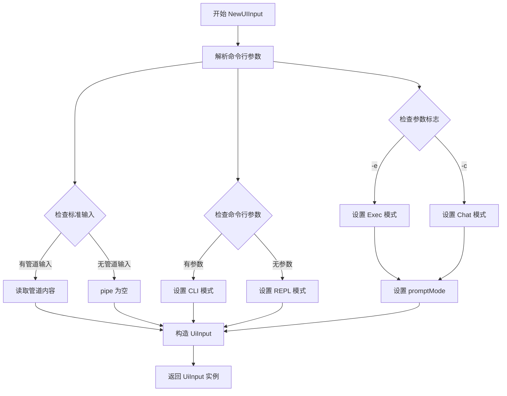
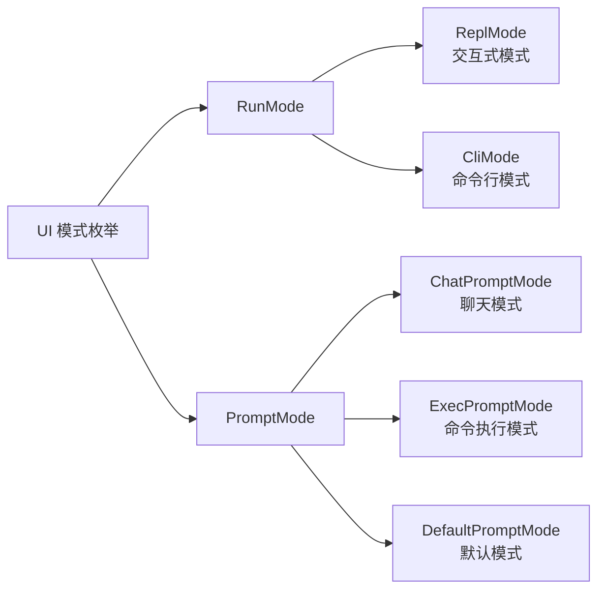
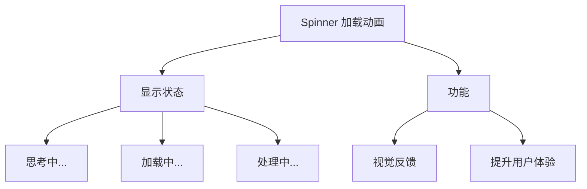
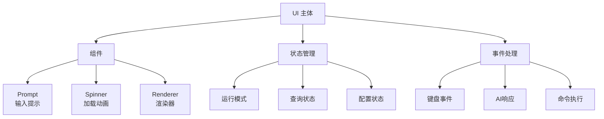
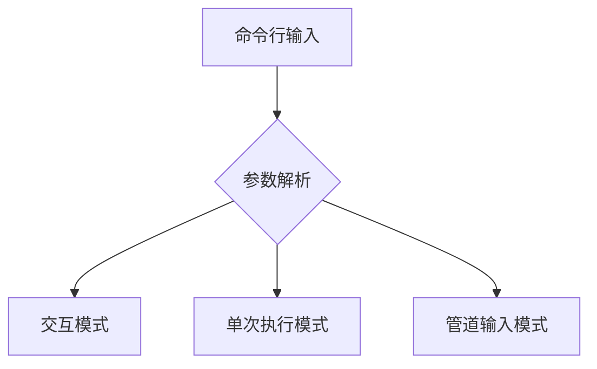
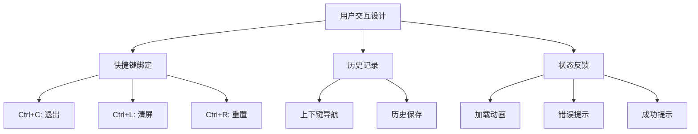
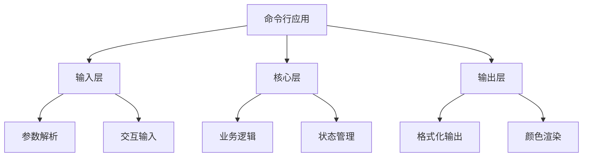

[TOC]

## 今日内容

### 修改yai 支持自定义url 










主要组件说明：

1. ui.go ：
   
   - UI 的核心控制器
   - 处理用户输入
   - 管理状态转换
   - 协调各个组件
2. spinner.go ：
   
   - 显示加载动画
   - 当 AI 思考或执行命令时提供视觉反馈
   - 提升用户体验
3. input.go ：
   
   - 处理命令行参数
   - 管理输入模式
   - 处理管道输入
4. prompt.go ：
   
   - 处理用户输入界面
   - 管理输入提示
   - 处理输入历史








从 Yai 可以学到的关键设计模式：

1. 输入处理 ：
   
   - 命令行参数解析
   - 管道输入处理
   - 交互式输入
   - 历史记录管理
2. 状态管理 ：
   
   - 运行模式切换
   - 状态机设计
   - 错误处理
3. 用户体验 ：
   
   - 加载动画
   - 颜色输出
   - 格式化显示
   - 帮助信息
4. 配置管理 ：
   
   - 配置文件读写
   - 用户设置持久化
这些都是构建命令行应用的基本要素，通过学习 Yai 的实现，你可以了解：

- 如何处理不同类型的输入
- 如何管理应用状态
- 如何提供良好的用户体验
- 如何组织代码结构


### zhihu 爬虫

我来分析一下知乎爬虫的主要逻辑结构:

### 1. 整体架构

整个知乎爬虫主要由以下几个核心组件构成:

1. **ZhihuCrawler** (<mcfile name="core.py" path="/Users/wangyangzuo/Desktop/my/my-notes/code/spider/MediaCrawler/media_platform/zhihu/core.py"></mcfile>)
- 爬虫的主类,负责整体流程控制
- 初始化浏览器环境
- 处理登录流程
- 执行具体的爬取任务

2. **ZhiHuClient** (<mcfile name="client.py" path="/Users/wangyangzuo/Desktop/my/my-notes/code/spider/MediaCrawler/media_platform/zhihu/client.py"></mcfile>)
- API客户端,负责与知乎服务器交互
- 封装各类API请求
- 处理请求签名和认证

3. **ZhihuExtractor** (<mcfile name="help.py" path="/Users/wangyangzuo/Desktop/my/my-notes/code/spider/MediaCrawler/media_platform/zhihu/help.py"></mcfile>)
- 数据提取器,负责解析响应数据
- 提取文章、评论等内容
- 格式化数据结构

### 2. 主要功能流程

爬虫支持三种主要的爬取模式:

1. **搜索模式** (search)
```python
- 根据关键词搜索内容
- 分页获取搜索结果
- 获取内容的评论信息
```

2. **指定内容模式** (detail) 
```python
- 直接爬取指定URL的内容
- 支持回答、文章、视频三种类型
- 同时获取评论信息
```

3. **创作者模式** (creator)
```python
- 爬取指定创作者的信息
- 获取创作者的所有内容(回答/文章/视频)
- 获取内容的评论信息
```

### 3. 反爬处理

爬虫采用了多种反爬虫措施:

1. **请求签名**
- 使用 <mcfile name="zhihu.js" path="/Users/wangyangzuo/Desktop/my/my-notes/code/spider/MediaCrawler/libs/zhihu.js"></mcfile> 计算签名
- 为每个请求添加必要的签名参数

2. **登录态维护**
- 支持二维码、Cookie、手机号三种登录方式
- 可以保存登录状态避免重复登录

3. **代理IP**
- 支持配置代理IP池
- 自动切换代理避免被封

4. **请求频率控制**
- 使用信号量控制并发
- 随机延迟请求间隔

### 4. 数据存储

通过 <mcfolder name="store" path="/Users/wangyangzuo/Desktop/my/my-notes/code/spider/MediaCrawler/store/zhihu"></mcfolder> 模块处理数据存储:

- 支持存储内容信息
- 支持存储评论信息  
- 支持存储创作者信息

### 5. 特色功能

1. **智能解析**
- 自动识别内容类型(回答/文章/视频)
- 统一的数据提取接口

2. **并发控制**
- 支持配置最大并发数
- 异步处理提高效率

3. **灵活配置**
- 支持多种运行模式
- 丰富的配置选项

这个爬虫项目的设计比较完善,采用了模块化的结构设计,具有很好的可扩展性和维护性。同时也充分考虑了反爬虫处理,是一个相对完整的爬虫解决方案。

## plan

- [ ] 通过 yai 学习命令行应用的设计模式
- [ ] 信息采集