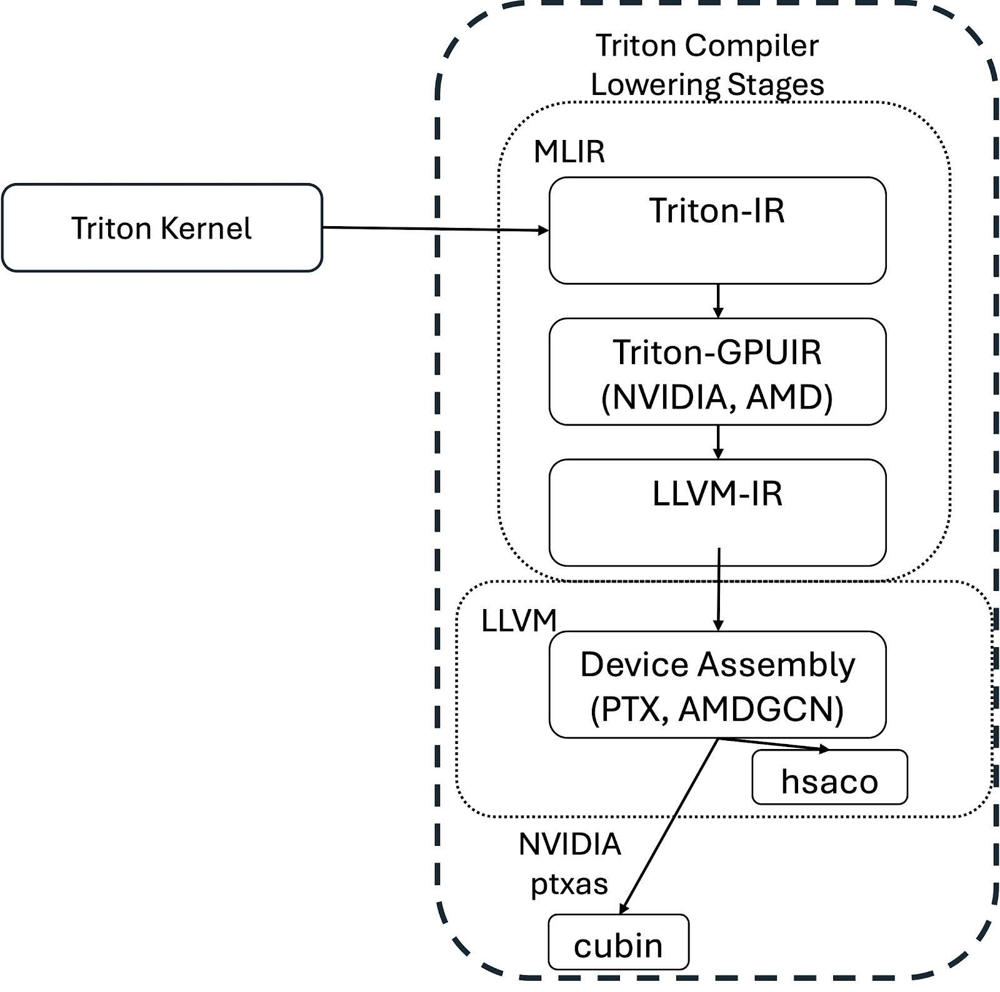
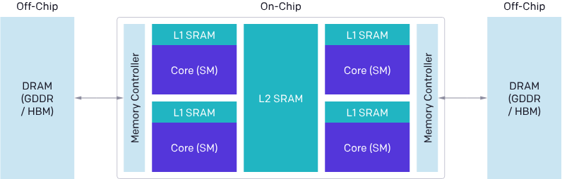
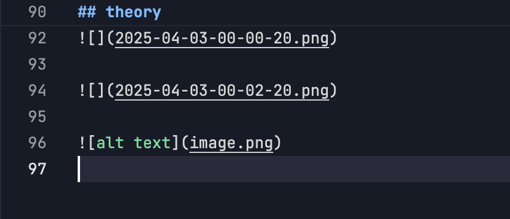

[TOC]

# basic

https://triton-lang.org/main/python-api/triton.language.html

## usage template

```python
import torch
import triton
import triton.language as tl

@triton.jit
def kernel(
    x_ptr,  # *Pointer* to first input vector
    y_ptr,  # *Pointer* to second input vector
    output_ptr,  # *Pointer* to output vector
    n_elements,  # Size of the vector
    BLOCK_SIZE: tl.constexpr,  # Number of elements each program should process
):
    # There are multiple 'program's processing different data. We identify which program
    # we are here
    pid = tl.program_id(axis=0)  # We use a 1D launch grid so axis is 0
    # This program will process inputs that are offset from the initial data.
    # for instance, if you had a vector of length 256 and block_size of 64, the programs
    # would each access the elements [0:64, 64:128, 128:192, 192:256].
    # Note that offsets is a list of pointers
    block_start = pid * BLOCK_SIZE
    offsets = block_start + tl.arange(0, BLOCK_SIZE)
    # Create a mask to guard memory operations against out-of-bounds accesses
    mask = offsets < n_elements
    # Load x and y from DRAM, masking out any extra elements in case the input is not a multiple of the block size
    x = tl.load(x_ptr + offsets, mask=mask)
    y = tl.load(y_ptr + offsets, mask=mask)
    output = x + y
    # Write x + y back to DRAM
    tl.store(output_ptr + offsets, output, mask=mask)


grid = lambda META: (triton.cdiv(META['n_elements'], META['BLOCK_SIZE']),)
kernel[grid](x, y, output, n_elements, BLOCK_SIZE=1024)

```

### advanced config

1. `torch.library.triton_op`：
- 这是一个装饰器（decorator），用于包装可能调用一个或多个 Triton 内核的函数
- 它帮助将 Triton 内核集成到 PyTorch 的调度系统中

2. `torch.library.wrap_triton`：
- 这是用来直接包装对 Triton 内核的调用
- 它处理 PyTorch 张量和 Triton 内核之间的数据转换

简单来说，这两个 API 的目的是让开发者能够方便地在 PyTorch 中使用 Triton 编写的高性能 GPU 内核。

举个例子：

```python
import torch
import triton
import triton.language as tl

@triton.jit
def add_kernel(x_ptr, y_ptr, output_ptr, n_elements):
    # Triton 内核的实现
    pass

# 使用 triton_op 包装函数
@torch.library.triton_op
def my_add(x: torch.Tensor, y: torch.Tensor) -> torch.Tensor:
    output = torch.empty_like(x)
    # 使用 wrap_triton 包装对 Triton 内核的调用
    torch.library.wrap_triton(add_kernel)(
        x.data_ptr(),
        y.data_ptr(),
        output.data_ptr(),
        x.numel()
    )
    return output
```

这样做的好处是：
1. 更好的性能优化
2. 更容易集成到 PyTorch 的生态系统中
3. 自动处理设备间的数据传输和类型转换


## theory





